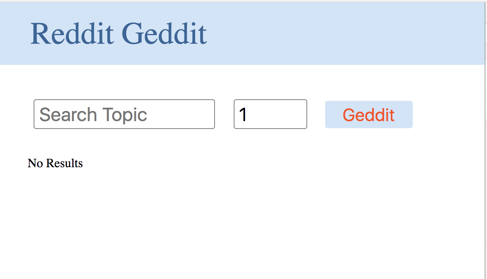

># Lab 27: Reddit Search Engine

A simple webpage using webpack and react, to perform a search of Reddit, displaying links to the results. The can type in a text query and limit the number of results.  The use can choose to see up to 100 results per search.

>## Install

```BASH
    npm i
```


```BASH
    npm run build
```

```BASH
    npm run watch
```

### Dependencies 

- This project has the following dependencies:

```JSON
   "devDependencies": {
    "babel-core": "^6.26.0",
    "babel-loader": "^7.1.2",
    "babel-preset-env": "^1.6.1",
    "babel-preset-react": "^6.24.1",
    "css-loader": "^0.28.9",
    "extract-text-webpack-plugin": "^3.0.2",
    "html-webpack-plugin": "^2.30.1",
    "node-sass": "^4.7.2",
    "react": "^16.2.0",
    "react-dom": "^16.2.0",
    "sass-loader": "^6.0.6",
    "superagent": "^3.8.2",
    "webpack": "^3.11.0",
    "webpack-dev-server": "^2.11.1"
  }
```

### npm scripts

- The following npm scripts are available:

```JSON
   "scripts": {
    "build": "webpack",
    "watch": "webpack-dev-server --inline --hot"
  },
```

>### HTML Page


